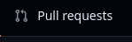
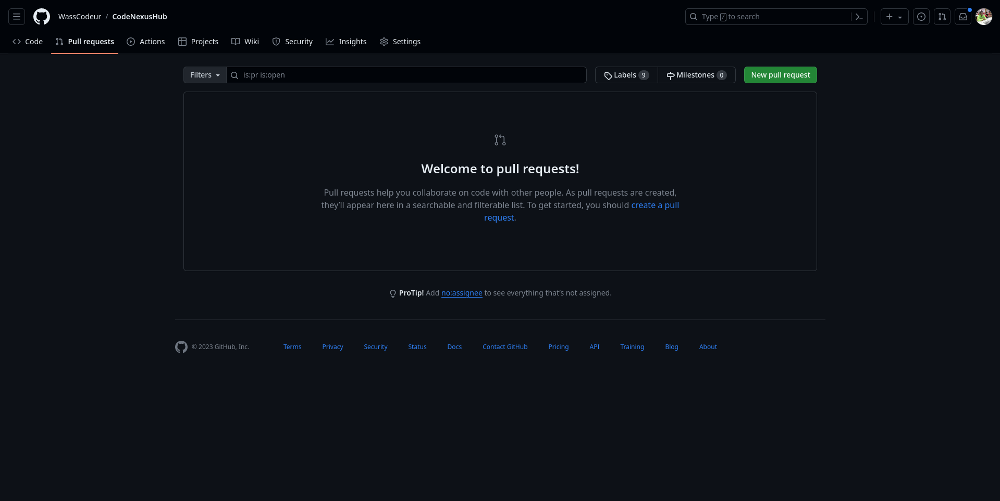
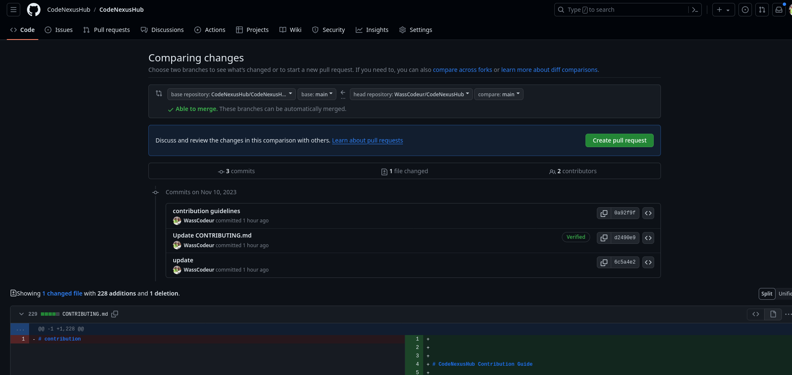
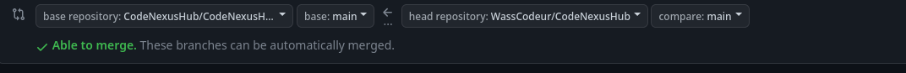
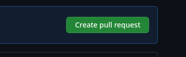
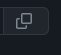
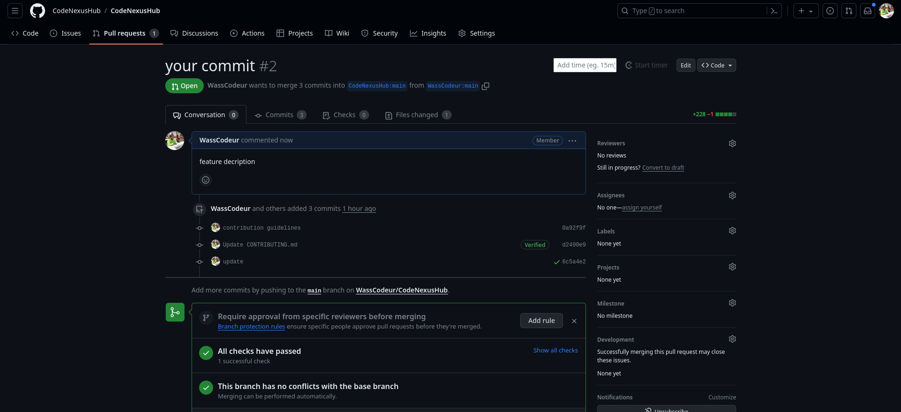

[English](CONTRIBUTING.md) | [Français](CONTRIBUTING.fr.md)

# Guide de contribution à CodeNexusHub


Bienvenue dans la communauté CodeNexusHub ! Nous sommes ravis que vous souhaitiez contribuer à notre projet. Avant de commencer, veuillez lire attentivement ce guide pour comprendre le processus de contribution.

## Table des matières
- [Guide de contribution à CodeNexusHub](#guide-de-contribution-à-codenexushub)
  - [Table des matières](#table-des-matières)
  - [Processus de contribution](#processus-de-contribution)
  - [Comment contribuer](#comment-contribuer)
  - [Félicitations Vous allez faitt!](#félicitations-vous-allez-faitt)
  - [Rapports de bugs](#rapports-de-bugs)
  - [Demandes de fonctionnalités](#demandes-de-fonctionnalités)
  - [Style de code](#style-de-code)
  - [Licence](#licence)
  - [Montrez votre soutien](#montrez-votre-soutien)

## Processus de contribution

1. Débrancher le projet.
2. Clonez votre fork localement.
3. Créer une nouvelle branche.
4. Effectuez vos modifications et livrez-les.
5. Transférez vos modifications vers votre branche.
6. Ouvrez une demande d'extraction depuis votre fork vers la branche `master` ou `main` du dépôt principal.
7. Attendez que votre demande d'extraction soit revue et fusionnée.
8. Célébrez votre contribution !
9. Répétez l'opération !
10. Si vous avez des questions, n'hésitez pas à nous les poser sur notre [Le Channel de discussions](https://github.com/orgs/CodeNexusHub/discussions).
11. Si vous souhaitez contribuer au projet, veuillez lire le [Code de conduite](CODE_OF_CONDUCT.md) et les [Directives de contribution](#comment-contribuer).

    Toutes les contributions sont les bienvenues ! N'hésitez pas à contribuer même à de petites corrections.

    Assurez-vous de discuter des changements majeurs ou des fonctionnalités avec l'équipe avant de commencer.

## Comment contribuer

1. Commencez par forker le projet.
   


2. Clonez votre fork localement :
   


    ```bash
   git clone https://github.com/VotreUsername/CodeNexusHub.git

    ```

    exemple: si votre nom d'utilisateur est "WassCodeur" alors la commande sera:

    ```bash
    git clone https://github.com/WassCodeur/CodeNexusHub.git
    ```
3. Créez une nouvelle branche :
   ```bash
    git checkout -b new-branch-name

    ```
    exemple: si vous voulez créer une nouvelle branche nommée "develop" alors la commande sera:
    ```bash
    git checkout -b develop
    ```

4. Faites vos modifications, et committez-les :
      ```bash
    git add .
    git commit -m "Your detailed description of your changes."

5. Poussez vos modifications vers votre fork :
    ```bash
    git push origin new-branch-name
    ```

6. Ouvrez une pull request de votre fork vers la branche `master` ou `main` du dépôt principal.










## Félicitations Vous allez faitt!


7. Attendez que votre pull request soit examinée et fusionnée.
   

## Rapports de bugs

Prochainement...

## Demandes de fonctionnalités

Si vous avez une idée de fonctionnalité, ouvrez une demande de fonctionnalité détaillée en suivant ces [instructions](ideas/README.md)

## Style de code

Prochainement...

## Licence

En contribuant à ce projet, vous acceptez que vos contributions soient placées sous les termes de [la licence du projet](LICENCE).

## Montrez votre soutien

Si vous trouvez ce projet utile ou intéressant, pensez à lui donner une étoile sur GitHub ! ⭐ C'est un moyen rapide et facile de montrer votre soutien et d'aider plus de gens à découvrir le projet.

